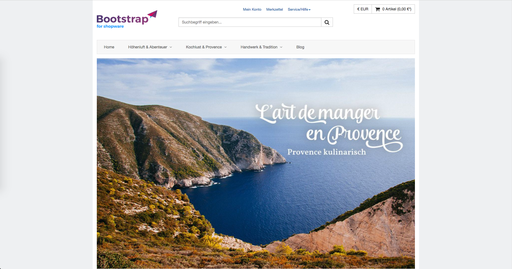
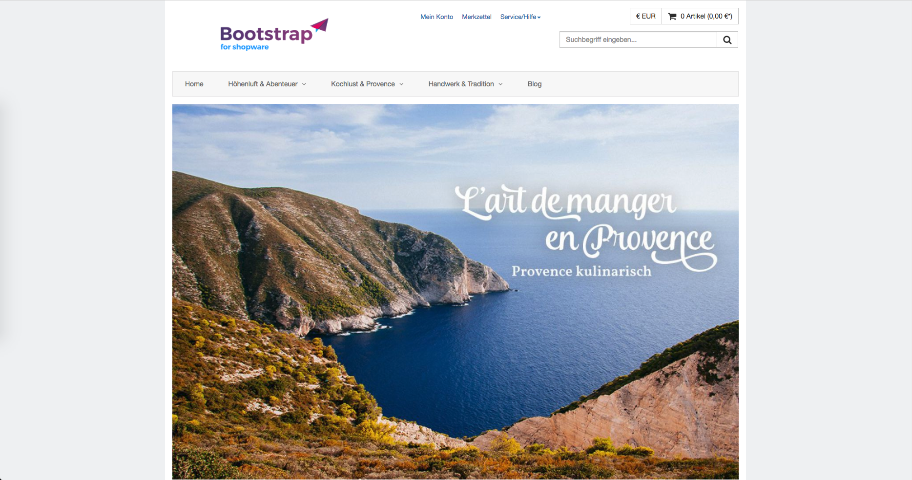

## In-Depth Structure

The Shopware Bootstrap Theme consists of a quite high number of files,
and in order to not to get lost completely in its vast structure, here is a short orientation.

### Plugin Structure

The Shopware Bootstrap Theme is in fact a theme wrapped in a plugin,
and therefore located in the `/custom/plugins`-Directory of your Shopware installation unlike regular themes in the `/themes`-Directory.
While Shopware themes work exactly the same no matter in which of these directories they are located in,
having a theme wrapped in a plugin is beneficial, because it allows for easy updates and versioning of the theme.

The structure of a plugin is quite simple.
It is covered in-depth in the [Shopware Documentation](https://developers.shopware.com/developers-guide/plugin-system/),
but here is a short summary of the relevant bits for theme development.

The minimal directory structure for a plugin containing a theme is following:

```
MyPlugin
├──Resources
│  └──Themes
│     └──Frontend
│        └──MyTheme
│           └──...
├──plugin.xml
└──MyPlugin.php
```
whereby the names `MyPlugin` and `MyTheme` are up to your choice.

#### Explanation

As you can see, the plugin's directory structure is quite simple. It should be after all, because it's only a wrapper for a theme.
The only files in your plugin that are not part of the theme itself are `plugin.xml` and `MyPlugin.php`, whereby `plugin.xml`
holds meta-data like the plugin's version, description and changelog, and `MyPlugin.php` consists of installation routines -
something we can safely neglect at the moment.

As this guide is mainly about theme development, we won't cover the plugin structure in-depth. If you want to read more about it,
please refer to [Shopware's Developer Guides](https://developers.shopware.com/developers-guide/plugin-system/)

#### Example

**MyPlugin.php**
```php
namespace MyPlugin\MyPlugin;

use Shopware\Components\Plugin;

class MyPlugin extends Plugin
{
}
```

**plugin.xml**
```xml
<?xml version="1.0" encoding="utf-8"?>
<plugin xmlns:xsi="http://www.w3.org/2001/XMLSchema-instance"
        xsi:noNamespaceSchemaLocation="https://raw.githubusercontent.com/shopware/shopware/5.2/engine/Shopware/Components/Plugin/schema/plugin.xsd">
    <label lang="en">My New Theme</label>
    <label lang="de">Mein Neues Theme</label>

    <version>1.0.0</version>
    <link>http://example.org</link>
    <author>conexco</author>
    <compatibility minVersion="5.3.0" />

    <changelog version="1.0.0">
        <changes lang="en">Initial release</changes>
        <changes lang="de">Initiales Release</changes>
    </changelog>
</plugin>
```

### Theme Structure

The `themes`-Directory is structured in the same way as the `themes`-Directory in Shopware itself.
Likewise, once the plugin is installed and activated, its contents are treated identically.

Shopware's main `themes`-directory consists of one `Frontend` and one `Backend` directory.
As the name suggests, the `Backend` directory contains templates for the Shop administration.
Consequently, our custom theme only contains a `Frontend`-directory.

In above example, the `Frontend`-directory contains one single directory - this is our Theme.
Theoretically, you can ship as many Themes as you like in one single plugin;
the Shopware Bootstrap Theme makes use of that mechanic with the _BootstrapBare_ and _BootstrapExtension_ themes.

The minimal directory structure of a theme is
```
MyTheme
└──Theme.php
```

If you can't think of anything else than floating question marks right now
and are asking yourself why there is only one file to be found here, let me explain!

Just like the `plugin.xml` in a plugin, the `Theme.php` in a theme contains basic information about its name,
author and its license. Also, this is the place where you define which theme yours is going to inherit from,
and where you can perform some elementary configuration.

#### Example

```php
<?php
// The deepest level of the namespace is identical with your theme's name
namespace Shopware\Themes\MyTheme;

use Doctrine\Common\Collections\ArrayCollection;
use Shopware\Components\Form as Form;
use Shopware\Components\Theme\ConfigSet;

class Theme extends \Shopware\Components\Theme
{
    /** @var string Defines the parent theme */
    protected $extend = 'BootstrapBare';

    /** @var string Defines the human readable name */
    protected $name = 'My Theme';

    /** @var string Description of the theme */
    protected $description = 'An example theme';

    /** @var string The author of the theme */
    protected $author = 'conexco';

    /** @var string License of the theme */
    protected $license = 'MIT';
}
```

### Template Directory Structure

Most template files are named after the controller action that renders said template
For example, the `cartAction` in the `Checkout`-controller renders the template `frontend/checkout/cart.tpl`.
The rest of template files are either extended from a template loaded by a controller action,
or included into one as a reusable component, for example the main menu.

## Creating Our First Theme

Let's get our hands dirty and create our first theme.
Suppose we sell only a handful of different products, all of which are advertised on the front page of our shop.
We decide to reduce the search bar and move it to the right, so that the shop's logo can be presented more prominently in the centre.

### Laying Out a Foundation

First of all, we want to have a plugin in which we wrap our theme; we're going to call it `SmallSearchBarTheme`.
Starting from the shop installation's root directory, we do following
```sh
cd custom/plugins
mkdir SmallSearchBarTheme && cd NoSearchBarTheme
```

In it, we're going to create our `plugin.xml` file for metadata and the `SmallSearchBarTheme.php`,
which contains the empty plugin class that's required for every plugin.

**plugin.xml**
```xml
<?xml version="1.0" encoding="utf-8"?>
<plugin xmlns:xsi="http://www.w3.org/2001/XMLSchema-instance"
        xsi:noNamespaceSchemaLocation="https://raw.githubusercontent.com/shopware/shopware/5.2/engine/Shopware/Components/Plugin/schema/plugin.xsd">
    <label>Small Search Bar Theme</label>
    <version>0.0.0dev01</version>
    <description>The Bootstrap Theme, but with a smaller search bar.</description>

    <compatibility minVersion="5.3.0"/>
    <author>conexco</author>
    <license>MIT</license>
</plugin>
```

**SmallSearchBarTheme.php**
```php
<?php
namespace SmallSearchBarTheme;

use Shopware\Components\Plugin;

class SmallSearchBarTheme extends Plugin
{
}
```

We are now able to install the plugin in the shop backend's plugin-manager, but we won't do that yet.

Now, we're going to create the directories for our theme. From the plugin's root directory (where we stopped earlier):
```sh
mkdir -p Resources/Themes/Frontend/SmallSearchBarTheme
cd Resources/Themes/Frontend/SmallSearchBarTheme
```

In it, we're going to create the `Theme.php`, which contains a class providing meta-data for the Theme.

**Theme.php**
```php
<?php
namespace Shopware\Themes\SmallSearchBarTheme;

class Theme extends \Shopware\Components\Theme
{
    protected $extend = 'BootstrapBare';

    protected $name = 'Small Search Bar Theme';

    protected $description = 'The Bootstrap Theme, but with a smaller search bar.';

    protected $author = 'conexco';

    protected $license = 'MIT';
}
```

Now, let's install the plugin. After installing and activating the theme, open the Theme Manager (_Configuration_->_Theme Manager_).
The theme should be listed there. Enable it by clicking on it, then on the button _Select theme_ in the lower right corner.

Upon visiting the frontend, no changes should be obvious, because our theme extends the Shopware Bootstrap Theme
and provides no changes to it. But that's something we're going to change now.

### Step by Step

Let's start with the search bar.

We know the search bar is visible on every page within the shop (well, except during the checkout process),
in the shop header. We can therefore assume that the template for the search bar is probably included in one of the templates
in the `frontend/index`-Directory. Just by looking at the file names in there, we can pinpoint the search bar's location
quite accurately.

```
/var/www/Shopware/custom/plugins/SwfBootstrapTheme/Themes/Frontend/BootstrapBare/frontend/index $ ls
breadcrumb.tpl
footer_minimal.tpl
footer-navigation.tpl
footer.tpl
header.tpl
index.tpl
logo-container.tpl
main-navigation.tpl
script-async-ready.tpl
search.tpl
shop-navigation.tpl
sidebar-categories.tpl
sidebar.tpl
sites-navigation.tpl
```
One of the files is called `search.tpl`. That sounds exactly like what we're looking for.
A quick look inside tells us that the entire search container, along with a form that wraps the input element,
is located inside the file. If we manage to stop including it in the header file, it shouldn't appear any more.

By a simple `grep 'search.tpl' *` within the `frontend/index`-directory,
we find out that the `search.tpl` is included in the `shop-navigation.tpl`.
Let's have a look

**frontend/index/shop-navigation.tpl**
```smarty
{block name='frontend_index_header_row_right_inner'}
    {block name='frontend_index_shop_navigation'}
        ...
    {/block}
    {block name='frontend_index_search_trusted'}
        <div class="row mvm">
            {block name='frontend_index_search_trusted_inner'}
                {block name='frontend_index_search'}
                    <div class="col-xs-12 col-md-8 col-lg-8">
                        {*! Search *}
                        {block name='frontend_index_search_inner'}
                            {include file="frontend/index/search.tpl"}
                        {/block}
                    </div>
                {/block}
                {block name='frontend_index_trusted'}
                    ...
                {/block}
            {/block}
        </div>
    {/block}
{/block}
```

The search container is being included in a block called `frontend_index_search_inner`, which is part of the block `frontend_index_search`.
In that block, there is a `div`, which uses some of the Boostrap framework's classes to define its size within its overlaying container, the header.

We're going to create our own `frontend/index/shop-navigation.tpl`-file in our SmallSearchBarTheme-directory, and it is going to extend
the original `frontend/index/shop-navigation.tpl`.

**frontend/index/shop-navigation.tpl**
```smarty
{extends file="parent:frontend/index/shop-navigation.tpl"}

{block name='frontend_index_search'}
    <div class="col-xs-12 col-md-6 col-md-offset-6">
        {block name='frontend_index_search_inner'}
            {include file="frontend/index/search.tpl"}
        {/block}
    </div>
{/block}
```

The first line tells Smarty that we're going to extend the parent theme's `frontend/index/shop-navigation.tpl` template.
That means, we take it as it is, and apply our changes to selected blocks. In our case, to `frontend_index_search`,
which we overwrite entirely to replace the `div`'s classes `col-md-8` by `col-md-6` and `col-md-offset-6`.

Next, we're going to move the logo a little bit into the centre. The logo is located in `frontend/index/logo-container.tpl`,
which is being included in the `frontend/index/index.tpl`. I decided to move the logo into the centre
by offsetting it slightly to the right. To do that, we must also reduce the entire right part of the header a little bit
so that there is enough space for the offset.

**frontend/index/index.tpl**
```smarty
{extends file="parent:frontend/index/index.tpl"}
{block name='frontend_index_header_row_left'}
    {* class col-md-offset-1 added *}
    <div class="col-sm-12 col-hd-5 col-md-3 col-md-offset-1">
        {*! Shop logo *}
        {include file="frontend/index/logo-container.tpl"}
    </div>
{/block}
{block name='frontend_index_header_row_right'}
    {* class col-md-8 replaces col-md-9 *}
    <div class="col-sm-12 col-hd-7 col-md-8">
        {* Shop navigation *}
        {block name='frontend_index_shop_navigation'}
            {include file="frontend/index/shop-navigation.tpl"}
        {/block}
    </div>
{/block}
```

And here is the result:

_Before_


_After_

