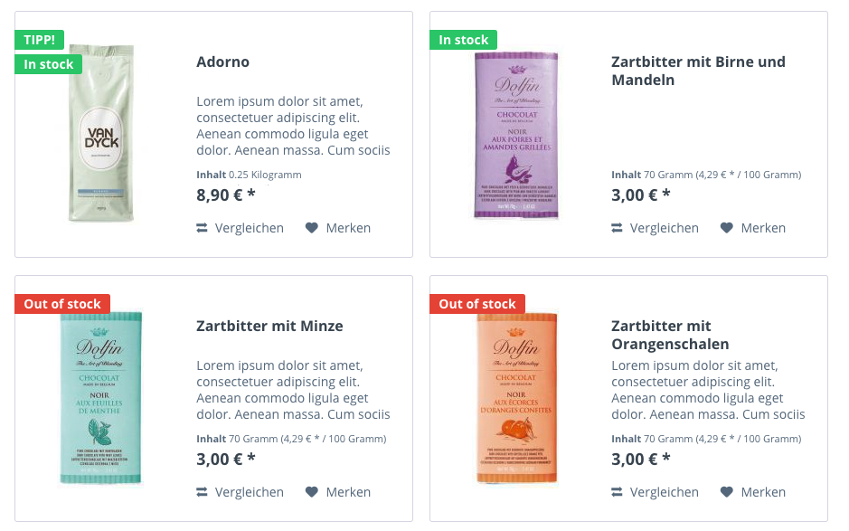
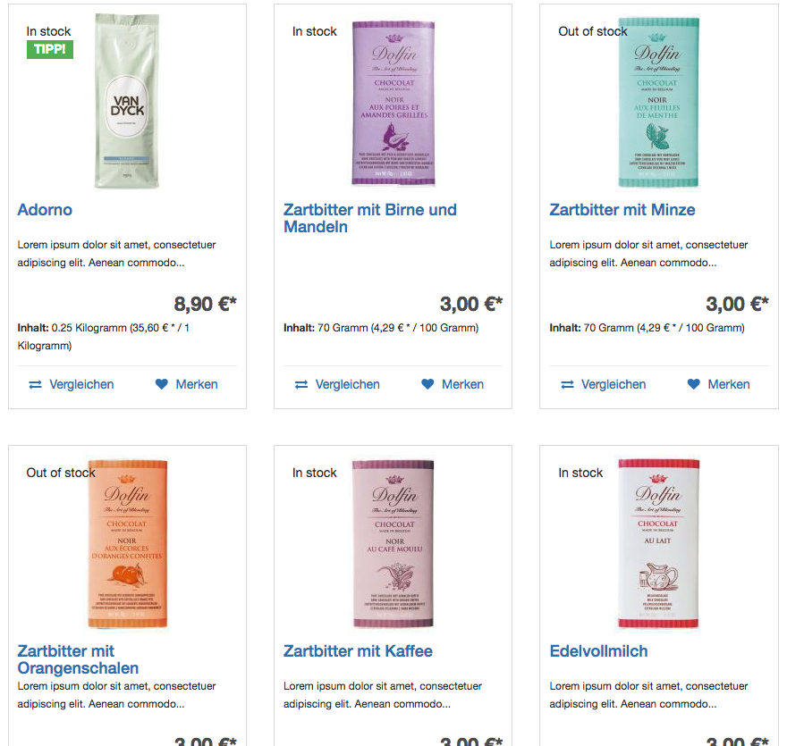
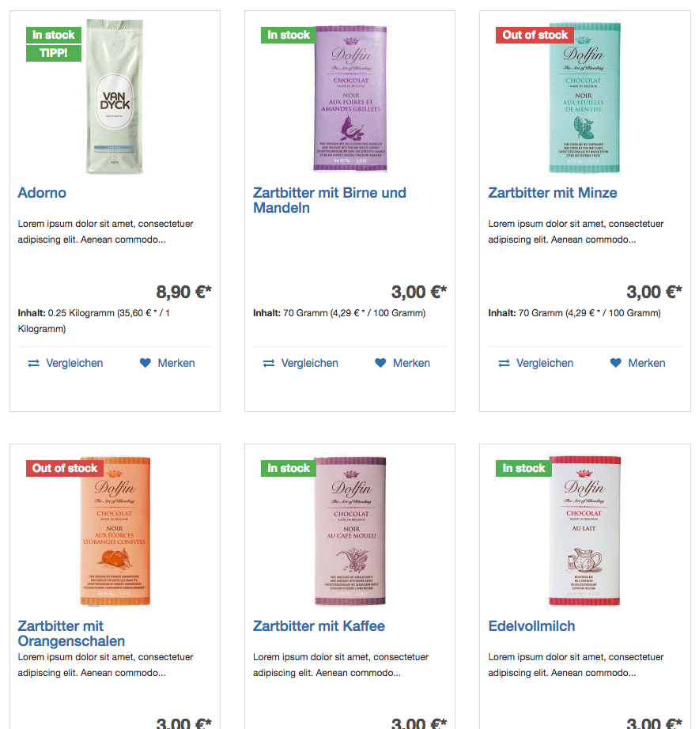

## Third Party Plugins

If you use third-party plugins in your shop, you will run into a problem: Almost all plugins are fitted to Shopware's Responsive Theme.
Hardly any will look like it's supposed to look in your shop. You will have to overwrite the plugins' template files to adjust them to the Bootstrap Theme.
Note that this isn't the case for plugins made by Shopware - adapted templates for those are already included in the `BootstrapExtension` theme.

The process of adapting a plugin's template files to the Bootstrap Theme isn't much different than the process of overwriting the theme's own template files.
In this example, we will be using a simple plugin, that extends the `frontend/listing/product-box/product-badges.tpl` file to add a badge, that shows
whether the product is in stock or not. [You can view the plugin's source code here](https://github.com/oktupol/shopware-stock-information-in-product-list){:target="_blank"},
but this guide will cover the relevant bits nevertheless.

The plugin doesn't consist of much, in fact, it's just the Plugin class itself (`StockInProductList\StockInProductList`) and one single template file.
The Plugin class only tells Shopware's view renderer to include its `Resources/Views` as template source directory in the `Listing` controller.
The template, as told earlier, extends `frontend/listing/product-box/product-badges.tpl`, specifically its block `frontend_listing_box_article_new`:

**frontend/listing/product-box/product-badges.tpl**
```smarty
{extends file="parent:frontend/listing/product-box/product-badges.tpl"}

{block name='frontend_listing_box_article_new'}
    {$smarty.block.parent}
    {block name='frontend_listing_box_article_stock'}
        <div class="product--badge badge--{if $sArticle.instock}recommend{else}discount{/if}">
            {if $sArticle.instock}
                In stock
            {else}
                Out of stock
            {/if}
        </div>
    {/block}
{/block}
```



However, the outcome in the Bootstrap Theme is rather disappointing:



Obviously, because the classes used for the `div` element are missing in the bootstrap theme. We have to overwrite the plugin's template files (or in this case, template file)
to adjust it to the Bootstrap Theme. To do that, we create a `frontend/listing/product-box/product-badges.tpl` in our Theme and overwrite the block that was introduced by the plugin:

**frontend/listing/product-box/product-badges.tpl**
```smarty
{extends file="parent:frontend/listing/product-box/product-badges.tpl"}

{block name='frontend_listing_box_article_stock'}
    <span class="label label-{if $sArticle.instock}success{else}danger{/if} img-label">
        {if $sArticle.instock}
            In stock
        {else}
            Out of stock
        {/if}
    </span>
{/block}
```

And the result: 



Excellent!

##### Problems You Might Run Into

Unfortunately, not every plugin vendor packs their code changes into new blocks. Some just extend blocks with their content -
in that case, there won't be a block you can conveniently overwrite. You might have to overwrite the block which the plugin extends.
In our case, that would be `frontend_listing_box_article_new`, or even the entire file.
Unfortunately, this could mean that you have to copy parts of the Bootstrap Theme without changes into your own theme,
since `{$smarty.block.parent}` would contain both the Bootstrap Theme's code and code introduced by any plugin that's extending it.
